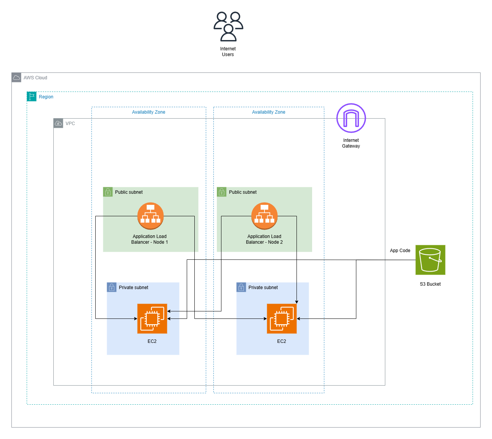

# AWS Cloud Platform — Terraform Project

A production-ready AWS infrastructure built for a simple Node.js app with
Terraform, demonstrating cloud/platform engineering
best practices.

## Architecture



## What This Project Builds

- VPC with public and private subnets across 2 AZs
- Application Load Balancer - Public Facing
- 2x EC2 t3.micro instances - In Private Subnets
- S3 bucket for app code storage
- IAM roles with least privilege
- Remote Terraform state in S3 + DynamoDB locking

## Tech Stack

| Tool        | Purpose                        |
|-------------|--------------------------------|
| Terraform   | Infrastructure as Code         |
| AWS VPC     | Network isolation              |
| AWS EC2     | Application compute            |
| AWS ALB     | Load balancing + health checks |
| AWS S3      | App code + Terraform state     |
| AWS IAM     | Least privilege access control |
| Node.js     | Sample application             |

## Project Structure
```
aws-terraform-node-app/
├── app/                          # Node.js sample app
│   ├── server.js
│   └── package.json
└── terraform/            
    ├── modules/
    │   ├── vpc/                  # VPC, subnets, IGW
    │   ├── ec2/                  # EC2, ALB, IAM, security groups
    │   └── s3/                   # App code bucket
├── docs/                         # Architecture Diagram
```
## Prerequisites

- AWS account with IAM user + access keys
- Terraform >= 1.0 installed
- AWS CLI configured (`aws configure`)
- Node.js 18+ (for local app testing)

## Quick Start

### 1. Clone the repo
```bash
git clone https://github.com/yasitha18243/aws-terraform-node-app.git
cd aws-terraform-node-app
```
### 2. Create Terraform State Storage
```bash
# Create S3 bucket for Terraform state
aws s3 mb s3://node-app-terraform-state-2026 --region ap-southeast-2

# Enable versioning
aws s3api put-bucket-versioning `
  --bucket ynode-app-terraform-state-2026 `
  --versioning-configuration Status=Enabled

# Create DynamoDB table for state locking
aws dynamodb create-table `
  --table-name terraform-state-lock `
  --attribute-definitions AttributeName=LockID,AttributeType=S `
  --key-schema AttributeName=LockID,KeyType=HASH `
  --billing-mode PAY_PER_REQUEST `
  --region ap-southeast-2
```
### 3. Run Terraform
```bash
cd terraform

# Download AWS provider
terraform init

# Preview what will be created
terraform plan

# Deploy
terraform apply
```
### 4. Test the App
```bash
# Get ALB URL
terraform output alb_dns_name

# Test endpoints
curl http:///health
curl http:///games
```
### 6. Destroy when done
```bash
terraform destroy
```
## Security Highlights

- EC2 instances are in **private subnets** — not directly
  accessible from the internet
- ALB is the **only public entry point**
- IAM roles use **least privilege** — EC2 can only
  read from its own S3 bucket
- Public access is blocked from the S3 bucket
- No hardcoded credentials anywhere in code
- Terraform state encrypted at rest in S3

## Estimated AWS Cost

| Resource      | Cost                        |
|---------------|-----------------------------|
| EC2 x2        | Free tier (t3.micro)        |
| ALB           | ~$0.025/hr (~$18/month)    |
| S3            | < $1/month                  |
| **Total**     | **~$0 with free tier**      |

> Always run `terraform destroy` when not in use

## Author

Yasitha Herath — [LinkedIn](https://www.linkedin.com/in/yasitha18243)
  | [GitHub](https://github.com/yasitha18243)

